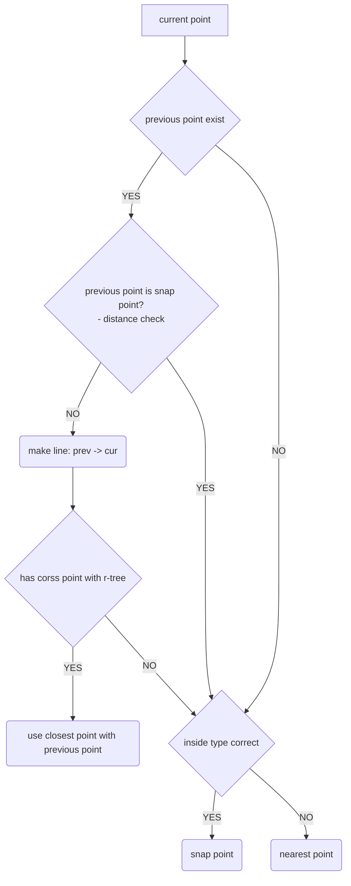

# 그리기 flow chart

```mermaid
flowchart TD
    CP[current point] --> PP{previous point exist}
    PP -->|YES| ISP{previous point is snap point?\n- distance check}
    ISP -->|NO| CR(make line: prev -> cur)
    ISP -->|YES| TYPE
    PP -->|NO| TYPE{inside type correct}
    TYPE -->|YES| SP(snap point)
    TYPE -->|NO| NP(nearest point)
    CR --> HASCR{has corss point with r-tree}
    HASCR -->|YES| A(use closest point with previous point)
    HASCR -->|NO| TYPE
```
